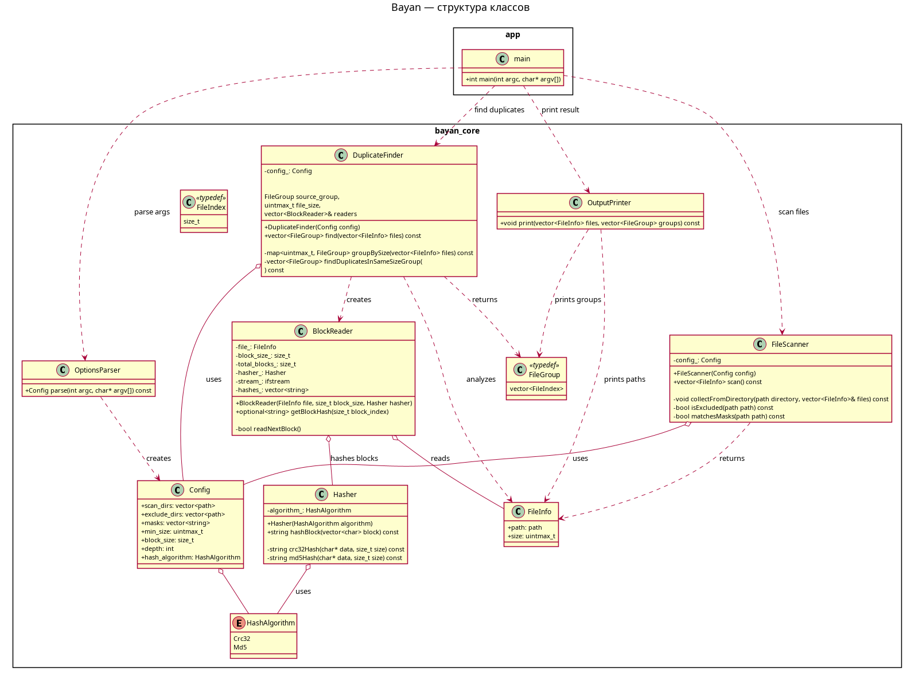
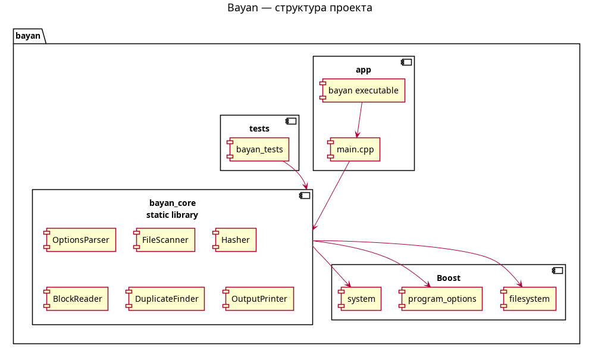

# Bayan

Утилита для поиска файлов-дубликатов по содержимому.

Программа сравнивает файлы блочно, не загружая файл целиком в память.
Сначала файлы группируются по размеру, затем сравниваются хеши блоков.
Чтение выполняется лениво: следующий блок читается только для тех файлов,
которые всё ещё могут оказаться дубликатами.

## Возможности

- сканирование одной или нескольких директорий;
- исключение директорий из сканирования;
- настройка глубины рекурсивного обхода;
- фильтрация файлов по минимальному размеру;
- фильтрация файлов по маскам имени;
- настройка размера блока чтения;
- выбор алгоритма хеширования блоков;
- бережное чтение файлов: каждый блок читается не более одного раза;
- вывод групп файлов с одинаковым содержимым.

## Использование

```bash
bayan [options]
```

Пример запуска:

```bash
bayan \
  --include ./data \
  --exclude ./data/tmp \
  --depth 3 \
  --min-size 1 \
  --mask "*.txt" "*.cpp" \
  --block-size 4096 \
  --hash crc32
```

## Параметры

| Параметр | Краткая форма | Описание |
|---|---|---|
| `--help` | `-h` | Показать справку по доступным параметрам. |
| `--include` | `-I` | Директории для сканирования. Можно указать одну или несколько директорий. |
| `--exclude` | `-E` | Директории, которые нужно исключить из сканирования. Можно указать одну или несколько директорий. |
| `--depth` | `-d` | Глубина рекурсивного сканирования. Значение `0` означает сканирование только указанных директорий без вложенных каталогов. |
| `--min-size` | `-m` | Минимальный размер файла в байтах. Файлы с размером меньше или равным этому значению не проверяются. По умолчанию: `1`. |
| `--mask` | `-M` | Маски имён файлов, разрешённых для сравнения. Например: `*.txt`, `*.cpp`. Если маски не указаны, проверяются все файлы. |
| `--block-size` | `-S` | Размер блока чтения в байтах. По умолчанию: `4096`. |
| `--hash` | `-H` | Алгоритм хеширования блока. Возможные значения: `crc32`, `md5`. По умолчанию: `crc32`. |

## Примеры запуска

Сканировать только текущую директорию:

```bash
bayan --include .
```

Сканировать директорию `data` без вложенных директорий:

```bash
bayan --include ./data --depth 0
```

Сканировать директорию `data` с глубиной `2`:

```bash
bayan --include ./data --depth 2
```

Сканировать несколько директорий:

```bash
bayan --include ./data ./backup --depth 3
```

Исключить директорию `tmp`:

```bash
bayan --include ./data --exclude ./data/tmp --depth 3
```

Проверять только текстовые файлы:

```bash
bayan --include ./data --mask "*.txt"
```

Проверять файлы с несколькими масками:

```bash
bayan --include ./data --mask "*.txt" "*.cpp" "*.hpp"
```

Игнорировать файлы размером меньше или равным `100` байтам:

```bash
bayan --include ./data --min-size 100
```

Использовать блоки по `5` байт:

```bash
bayan --include ./data --block-size 5
```

Использовать алгоритм `md5`:

```bash
bayan --include ./data --hash md5
```

## Формат вывода

Результатом работы программы является список полных путей файлов с идентичным
содержимым.

Каждый файл выводится на отдельной строке.

Файлы из одной группы дубликатов выводятся подряд.
Разные группы дубликатов разделяются пустой строкой.

Пример вывода:

```text
/home/user/data/a.txt
/home/user/data/copy/a_copy.txt

/home/user/data/image.png
/home/user/backup/image_copy.png
```

В этом примере найдены две группы дубликатов:

- `a.txt` и `a_copy.txt`;
- `image.png` и `image_copy.png`.

## Принцип работы

Сравнение файлов выполняется поэтапно.

Сначала программа собирает список файлов, подходящих под заданные параметры.
После этого файлы группируются по размеру. Файлы разного размера не могут быть
дубликатами, поэтому они не сравниваются между собой.

Для файлов одинакового размера выполняется блочное сравнение:

1. читается первый блок каждого файла;
2. для каждого блока вычисляется хеш;
3. файлы группируются по хешу первого блока;
4. группы, в которых остался только один файл, отбрасываются;
5. для оставшихся групп читается следующий блок;
6. процесс повторяется до конца файла.

Если у нескольких файлов совпала вся последовательность хешей блоков, такие
файлы считаются дубликатами.

## Особенности чтения файлов

Файл не загружается в память целиком.

Каждый блок файла читается только тогда, когда это действительно необходимо.
Если на каком-то блоке стало понятно, что файл отличается от остальных файлов
в группе, дальнейшие блоки этого файла не читаются.

Последний блок файла, если он меньше заданного размера блока, дополняется
нулевыми байтами перед вычислением хеша.

Например, при размере блока `5` файл:

```text
Hello, World.txt
```

может быть представлен блоками:

```text
Hello
, Wor
ld.tx
t\0\0\0\0
```

## Архитектура проекта

Проект разделён на исполняемое приложение и статическую библиотеку.

```text
bayan/
├── CMakeLists.txt
├── bayan_core/
│   ├── CMakeLists.txt
│   ├── include/
│   │   └── bayan/
│   │       ├── BlockReader.hpp
│   │       ├── Config.hpp
│   │       ├── DuplicateFinder.hpp
│   │       ├── FileInfo.hpp
│   │       ├── FileScanner.hpp
│   │       ├── Hasher.hpp
│   │       ├── OptionsParser.hpp
│   │       └── OutputPrinter.hpp
│   └── src/
│       ├── BlockReader.cpp
│       ├── DuplicateFinder.cpp
│       ├── FileScanner.cpp
│       ├── Hasher.cpp
│       ├── OptionsParser.cpp
│       └── OutputPrinter.cpp
├── app/
│   ├── CMakeLists.txt
│   └── main.cpp
├── doc/
│   ├── Bayan_Class_Diagram.puml
│   ├── Bayan_Class_Diagram.png
│   ├── Bayan_Component_Diagram.puml
│   └── Bayan_Component_Diagram.png
└── tests/
    ├── CMakeLists.txt
    └── DuplicateFinderTests.cpp
```

## Назначение модулей

| Модуль | Назначение |
|---|---|
| `OptionsParser` | Разбор аргументов командной строки и формирование конфигурации приложения. |
| `FileScanner` | Поиск файлов, подходящих под заданные параметры. |
| `Hasher` | Вычисление хеша блока данных. |
| `BlockReader` | Ленивое чтение файла по блокам и кеширование хешей прочитанных блоков. |
| `DuplicateFinder` | Поиск групп файлов-дубликатов. |
| `OutputPrinter` | Вывод найденных групп дубликатов в стандартный поток вывода. |

## Диаграммы

### Диаграмма классов



### Диаграмма компонентов



## Сборка

Для сборки требуется:

- компилятор с поддержкой C++17;
- CMake;
- Boost с компонентами `filesystem`, `program_options`, `system`.

Установка зависимостей в Ubuntu:

```bash
sudo apt install cmake g++ \
  libboost-filesystem-dev \
  libboost-program-options-dev \
  libboost-system-dev
```

Сборка проекта:

```bash
cmake -S . -B build
cmake --build build
```

## Запуск после сборки

Если исполняемый файл собирается в каталоге `build/app`, запуск может выглядеть так:

```bash
./build/app/bayan --include ./data --depth 3
```

Если исполняемый файл собирается напрямую в `build`, запуск может выглядеть так:

```bash
./build/bayan --include ./data --depth 3
```

## Запуск тестов

Если в проекте включены тесты, их можно запустить командой:

```bash
ctest --test-dir build
```

Или напрямую:

```bash
./build/tests/bayan_tests
```

## Сборка Debian-пакета

Если проект собирается с поддержкой CPack, можно собрать Debian-пакет:

```bash
cmake --build build --target package
```

После этого пакет можно установить командой:

```bash
sudo dpkg -i build/*.deb
```

## Пример полного запуска

```bash
cmake -S . -B build
cmake --build build

./build/app/bayan \
  --include ./data \
  --exclude ./data/tmp \
  --depth 3 \
  --min-size 1 \
  --mask "*.txt" "*.cpp" \
  --block-size 4096 \
  --hash crc32
```