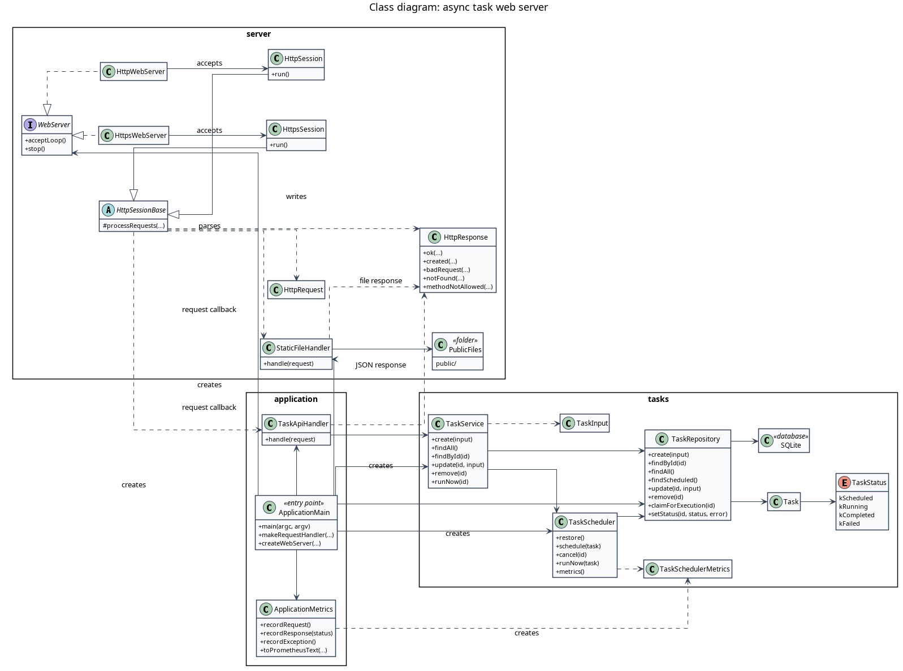
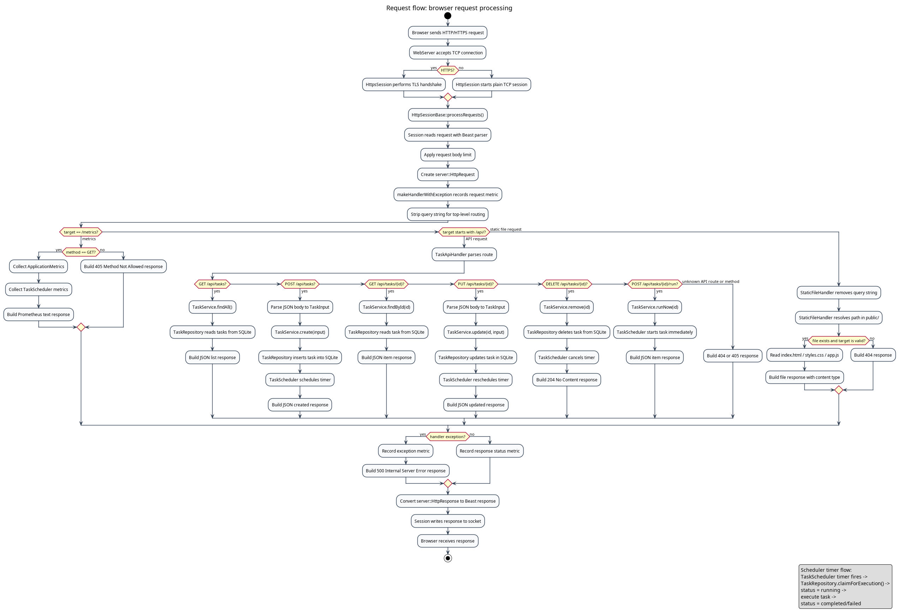

# Async Task Web Server

Учебный веб-сервер на C++20, Boost.Asio, Boost.Beast, OpenSSL и SQLite.

Проект реализует веб-приложение для управления отложенными задачами:

- создание задачи с временем выполнения;
- просмотр списка задач;
- редактирование задачи;
- удаление задачи;
- ручной запуск задачи;
- восстановление запланированных задач после перезапуска сервера;
- экспорт метрик в формате Prometheus.

Проект разделён на несколько независимых компонентов:

- `async_web_server` — HTTP/HTTPS транспорт, coroutine-сессии и статические файлы;
- `task_system` — модель задач, SQLite-репозиторий, сервис задач и планировщик таймеров;
- `common` — общий потокобезопасный логер;
- `app` — исполняемое приложение, конфигурация, метрики и HTTP-адаптер `TaskApiHandler`.

Исполняемый файл связывает серверную библиотеку и систему задач через прикладной HTTP-адаптер `TaskApiHandler`.

## Структура проекта

```text
async_task_web_server/
├── CMakeLists.txt
├── app/
│   ├── ApplicationMetrics.cpp
│   ├── ApplicationMetrics.hpp
│   ├── AppConfig.hpp.in
│   ├── TaskApiHandler.cpp
│   ├── TaskApiHandler.hpp
│   └── main.cpp
├── async_web_server/
│   ├── CMakeLists.txt
│   ├── include/server/
│   └── src/server/
├── common/
│   ├── CMakeLists.txt
│   ├── include/common/
│   └── src/common/
├── config/
│   └── async_task_web_server.json
├── doc/
│   ├── class_diagram.puml
│   ├── class_diagram.png
│   ├── request_flow.puml
│   └── request_flow.png
├── public/
│   ├── index.html
│   ├── styles.css
│   └── app.js
├── task_system/
│   ├── CMakeLists.txt
│   ├── include/tasks/
│   └── src/tasks/
└── tests/
    └── TaskSchedulerTests.cpp
```

## Зависимости

```bash
sudo apt update
sudo apt install -y \
    build-essential \
    cmake \
    libboost-system-dev \
    libssl-dev \
    libsqlite3-dev
```

Для генерации диаграмм дополнительно:

```bash
sudo apt install -y plantuml graphviz
```

## Сборка

```bash
cmake -S . -B build -DCMAKE_BUILD_TYPE=Debug
cmake --build build -j
```

В результате создаются:

```text
build/async_web_server/libasync_web_server.a
build/task_system/libtask_system.a
build/common/libcommon.a
build/app/async_task_web_server
```

После сборки рядом с исполняемым файлом копируются:

```text
build/app/public/
build/app/config/async_task_web_server.json
```

## Запуск HTTP

```bash
./build/app/async_task_web_server \
    --protocol http \
    --port 8080 \
    --database build/app/data/tasks.db
```

Открыть в браузере:

```text
http://localhost:8080
```

Также можно запустить сервер только с конфигурационным файлом:

```bash
./build/app/async_task_web_server \
    --config build/app/config/async_task_web_server.json
```

## Запуск HTTPS

Для HTTPS нужны TLS-сертификат и приватный ключ.

По умолчанию приложение ожидает файлы:

```text
certs/server.crt
certs/server.key
```

Пример запуска:

```bash
./build/app/async_task_web_server \
    --protocol https \
    --port 8443 \
    --database build/app/data/tasks.db \
    --cert certs/server.crt \
    --key certs/server.key
```

Открыть в браузере:

```text
https://localhost:8443
```

## Конфигурация через JSON

Параметры запуска можно передать через JSON-файл:

```bash
./build/app/async_task_web_server \
    --config config/async_task_web_server.json
```

Если параметр `--config` не указан, приложение ищет конфигурационный файл в следующих местах:

```text
<binary_dir>/config/async_task_web_server.json
/etc/async_task_web_server/async_task_web_server.json
```

CLI-аргументы имеют приоритет над файлом конфигурации:

```bash
./build/app/async_task_web_server \
    --config config/async_task_web_server.json \
    --port 9090
```

Пример конфигурации:

```json
{
  "server": {
    "protocol": "http",
    "host": "0.0.0.0",
    "port": 8080,
    "threads": 4,
    "public_dir": "public"
  },
  "storage": {
    "database": "data/tasks.db"
  },
  "tls": {
    "certificate_file": "certs/server.crt",
    "private_key_file": "certs/server.key"
  },
  "logging": {
    "level": "info"
  }
}
```

Поддерживаемые CLI-параметры:

```text
--config <path>         JSON configuration file
--protocol <http|https> Server protocol, default: https
--host <address>        Bind address, default: 0.0.0.0
--port <number>         Bind port, default: 8080/8443
--threads <number>      io_context worker threads, default: 4
--public-dir <path>     Web interface directory
--database <path>       SQLite database file
--cert <path>           TLS certificate file
--key <path>            TLS private key file
--log-level <level>     debug, info, warning, error
--help                  Show help
```

## Зависимости между целями

```text
async_task_web_server executable
├── async_web_server::async_web_server
├── common::common
└── task_system::task_system
```

`async_web_server` ничего не знает о задачах и SQLite.

`task_system` ничего не знает об HTTP, HTTPS и статических файлах.

`TaskApiHandler` расположен в исполняемом приложении и связывает HTTP-слой с сервисом задач.

## HTTP API

### Получить список задач

```http
GET /api/tasks
```

### Получить задачу по ID

```http
GET /api/tasks/{id}
```

### Создать задачу

```http
POST /api/tasks
Content-Type: application/json
```

```json
{
  "title": "Example task",
  "description": "Task description",
  "scheduledAt": 1780000000000
}
```

### Обновить задачу

```http
PUT /api/tasks/{id}
Content-Type: application/json
```

```json
{
  "title": "Updated task",
  "description": "Updated description",
  "scheduledAt": 1780000000000
}
```

### Удалить задачу

```http
DELETE /api/tasks/{id}
```

### Запустить задачу вручную

```http
POST /api/tasks/{id}/run
```

## Метрики

Метрики доступны в Prometheus text format:

```text
http://localhost:8080/metrics
```

Экспортируются:

- общее количество HTTP-запросов;
- количество HTTP-ответов по классам статусов;
- количество необработанных исключений;
- количество запланированных задач;
- количество отменённых задач;
- количество успешно выполненных задач;
- количество задач с ошибкой;
- количество ошибок таймеров.

## Логирование

Добавлен простой потокобезопасный логер без внешних зависимостей.

Уровень логирования задаётся через CLI или JSON-конфиг:

```bash
./build/app/async_task_web_server --log-level debug
```

Доступные уровни:

```text
debug
info
warning
error
```

## Архитектурные диаграммы

### Диаграмма классов

Диаграмма показывает основные компоненты приложения: HTTP/HTTPS сервер, обработку сессий, маршрутизацию запросов, API задач, планировщик задач и слой хранения данных.



Исходник диаграммы: [`doc/class_diagram.puml`](doc/class_diagram.puml)

### Поток обработки HTTP-запроса

Диаграмма показывает общий путь HTTP-запроса: от подключения клиента и чтения запроса до выбора обработчика, выполнения API-операции или отдачи статического файла.



Исходник диаграммы: [`doc/request_flow.puml`](doc/request_flow.puml)

### Перегенерация диаграмм

```bash
plantuml -tpng doc/class_diagram.puml doc/request_flow.puml
```

После выполнения команды будут обновлены файлы:

```text
doc/class_diagram.png
doc/request_flow.png
```

## Unit-тесты

Добавлены тесты для `TaskScheduler`:

- выполнение запланированной задачи;
- отмена задачи;
- повторное планирование и игнорирование старого callback таймера;
- восстановление задач из репозитория.

Запуск тестов:

```bash
cmake -S . -B build -DBUILD_TESTING=ON
cmake --build build -j
ctest --test-dir build --output-on-failure
```

## Сборка DEB-пакета

Проект поддерживает генерацию DEB-пакета через CPack:

```bash
cmake -S . -B build -DCMAKE_BUILD_TYPE=Release
cmake --build build -j
cmake --build build --target package
```

После сборки пакет появится в каталоге `build/`.

При установке пакета:

- бинарный файл устанавливается в системный каталог исполняемых файлов;
- статические файлы веб-интерфейса устанавливаются в каталог данных приложения;
- конфигурационный файл устанавливается в `/etc/async_task_web_server/async_task_web_server.json`.

## Особенности реализации

- сервер использует Boost.Asio coroutine-based обработку;
- HTTP и HTTPS реализованы через отдельные серверные классы;
- общая логика HTTP/HTTPS-сессий вынесена в `HttpSessionBase`;
- статические файлы обслуживаются через `StaticFileHandler`;
- REST API задач реализован через `TaskApiHandler`;
- задачи хранятся в SQLite;
- отложенное выполнение реализовано через `boost::asio::system_timer`;
- при старте приложения планировщик восстанавливает задачи из базы данных;
- graceful shutdown выполняется через обработку `SIGINT` и `SIGTERM`.
